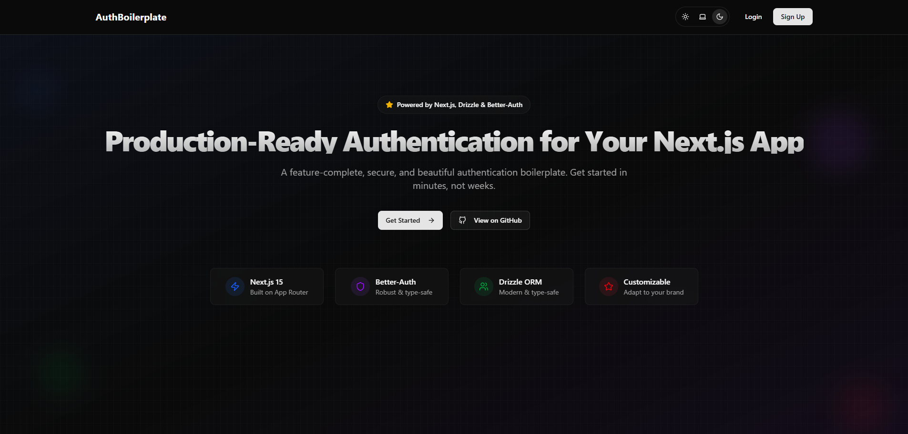

# Next.js Better Auth Starterkit


[](https://vercel.com/new/clone?repository-url=https://github.com/Dendro-X0/next-better-auth-starter&project-name=next-better-auth-starter&repository-name=next-better-auth-starter&env=BETTER_AUTH_SECRET,DATABASE_URL,NEXT_PUBLIC_APP_URL,RESEND_API_KEY,EMAIL_FROM,MAIL_PROVIDER,SMTP_HOST,SMTP_PORT,SMTP_SECURE,SMTP_USER,SMTP_PASS,GOOGLE_CLIENT_ID,GOOGLE_CLIENT_SECRET,GITHUB_CLIENT_ID,GITHUB_CLIENT_SECRET,UPSTASH_REDIS_URL,UPSTASH_REDIS_TOKEN)

## Introduction

This is a production-ready boilerplate for Next.js 15, featuring a robust authentication system powered by **Better Auth**. It includes everything you need to build a secure, modern app: email/password, social logins, magic links, password reset, and two-factor authentication (2FA).



## ✨ Features

- **Full-Stack Framework**: Built with the latest Next.js 15 App Router.
- **Modern Authentication**: Powered by [Better Auth](https://www.better-auth.com), providing a secure and flexible authentication foundation.
- **Complete Auth Flows**: 
  - Email & Password (with password strength indicator)
  - Social Login (Google & GitHub)
  - Passwordless Magic Links
  - Secure Password Reset
  - **Two-Factor Authentication (2FA)** with TOTP and Backup Codes
- **Database & ORM**: PostgreSQL with [Drizzle ORM](https://orm.drizzle.team) for type-safe database access.
- **UI & Styling**: Beautifully designed components from [Shadcn UI](https://ui.shadcn.com/) and styled with [Tailwind CSS](https://tailwindcss.com/).
- **Form Handling**: Robust and type-safe forms using Server Actions and `useActionState`.
- **Type Safety**: End-to-end type safety with TypeScript.
- **Environment Variables**: Zod-based validation for environment variables using T3 Env.

## Quick Start

```bash
pnpm install
cp .env.example .env
pnpm db:migrate
pnpm dev
```

Open http://localhost:3000 in your browser. For full setup, see `docs/getting-started.md` and `docs/configuration.md`.

## Documentation

Topic-focused guides live in `docs/`:

- Overview: [docs/overview.md](docs/overview.md)
- Getting Started: [docs/getting-started.md](docs/getting-started.md)
- Configuration (env vars): [docs/configuration.md](docs/configuration.md)
- Deployment: [docs/deployment.md](docs/deployment.md)
- Mobile & Accessibility: [docs/a11y-mobile.md](docs/a11y-mobile.md)
- Distributed Rate Limiting: [docs/rate-limiting.md](docs/rate-limiting.md)

## 📄 License

This project is licensed under the MIT License.
